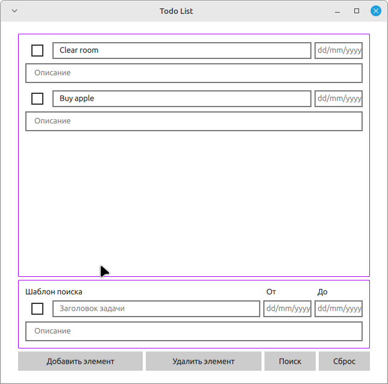

# ToDoList

ToDoList - это приложение для управления задачами, разработанное с использованием C++, Qt6, QML и CMake.

## Стэк

- C++
- Qt6
- QML
- CMake

## Использование



### Добавить элемент

Создается пустая задача с чекбоксом, заголовком, описанием и датой.

### Удалить элемент

Удаляет задачу с заполненным чекбоксом.

### Поиск

Ищет по шаблону. Поиск рекурсивный, будет искать дальше по выборке.

### Сброс

Возвращает список задач до поиска.

### Шаблон поиска

Поиск осуществляется по заголовку и описанию. Ищет вхождения по символам или словам, а также по дате, включая указанный день.

### Сохранение и загрузка

Сохранение и загрузка происходят автоматически.

## Build

Сборка проекта осуществляется через CMake:

```bash
cmake -S ./ -B ./build # "./" - текущая директория проекта, где расположен CMakeLists.txt
cmake --build ./build
```
